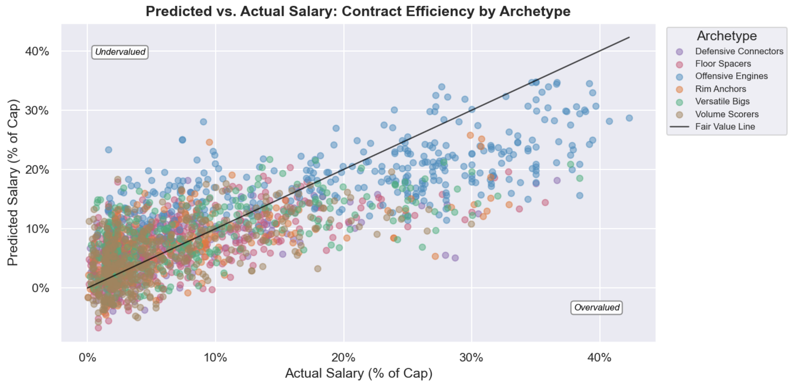
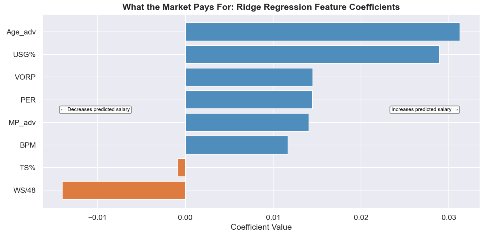
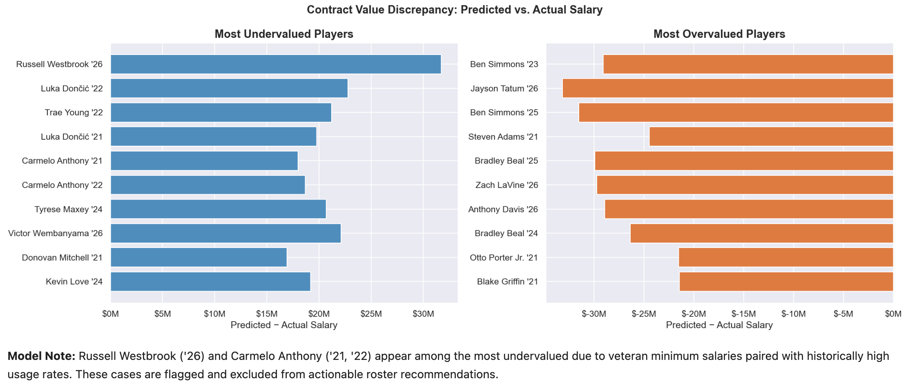
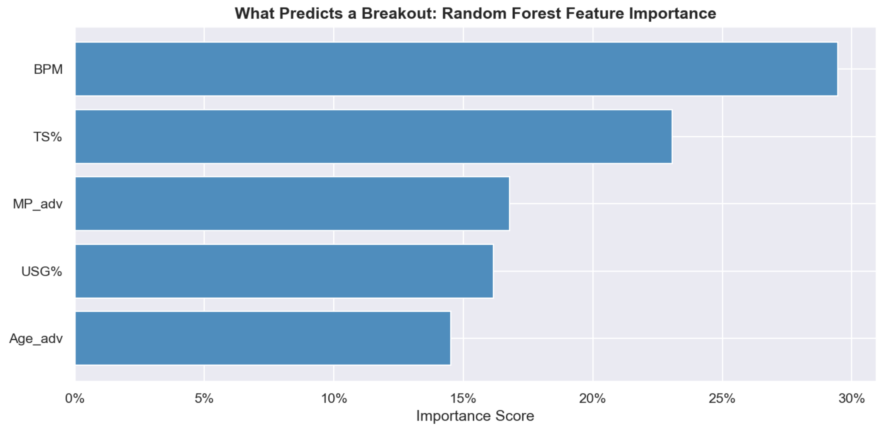
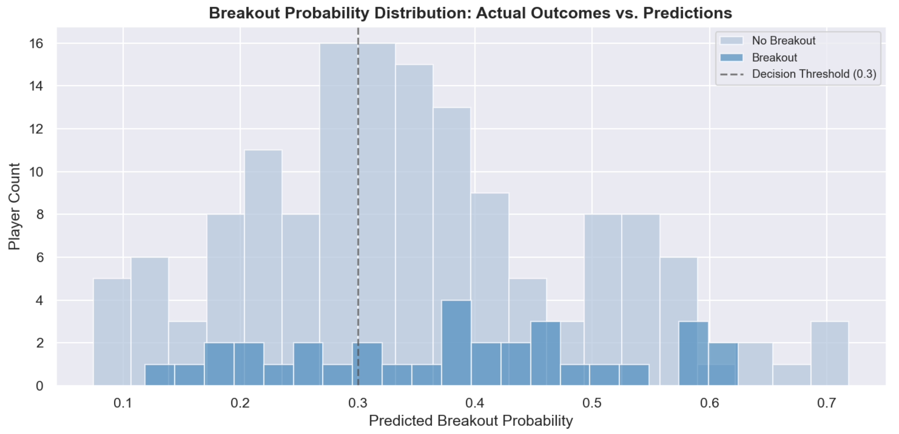
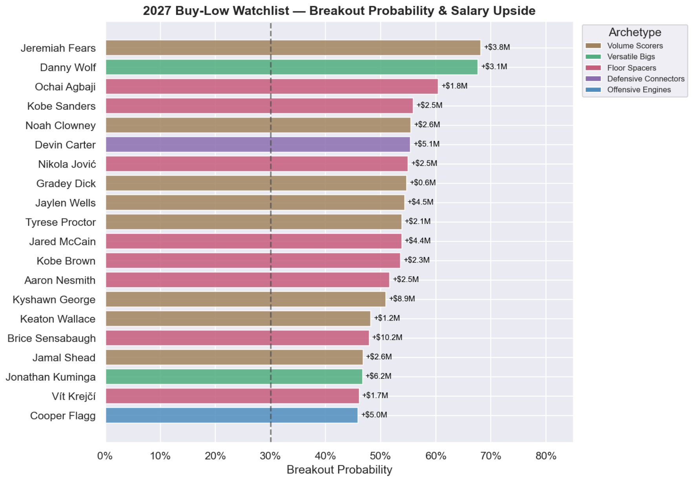

# NBA Player Value Analysis (2021-2026)
## Client Background
A Western Conference franchise's analytics department is preparing for the 2026 offseason and wants to move beyond traditional scouting by leveraging six seasons of performance data to identify undervalued players, understand roster composition, and flag breakout candidates before they price themselves out of the market. This analysis is structured around four questions front offices increasingly need data to answer: how has the league itself changed, what types of players actually exist, who is being paid fairly, and who has the potential to break out.

**The League Landscape:**
An examination of league-wide trends from 2021 to 2026 across scoring, shot selection, and efficiency, establishing the analytical context for evaluating individual players in later sections.

**Defining the Modern NBA Player:**
An unsupervised clustering analysis grouping 2,068 player-seasons into six meaningful archetypes based on efficiency, usage, and skill profiles, moving beyond traditional position labels to capture what players actually do on the floor.

**Contract Value & Market Efficiency:**
A Ridge regression model predicting fair market salary as a percentage of the cap, then comparing predicted versus actual salary to surface undervalued and overvalued players across the league.

**Breakout Candidate Identification:**
A Random Forest classification model identifying players likely to significantly improve their impact from one season to the next, helping the front office target players before their next contract reflects their true ceiling.

The data cleaning notebook can be found [here](https://github.com/Oxalate2/nba-player-value-analysis/blob/main/data-cleaning.ipynb).

The full analysis notebook can be found [here](https://github.com/Oxalate2/nba-player-value-analysis/blob/main/analysis.ipynb).

# Key Insights
## The League Landscape (2021-2026)
The NBA has undergone measurable structural shifts across just six seasons. The league's average three-point attempt rate climbed from **40.3% in 2021** to **42.1% in 2026**, a steady upward trend reflecting an offensive philosophy that has fully committed to the analytics-driven shot hierarchy. The pace of change accelerated noticeably in the final two seasons, suggesting the three-point revolution has not plateaued.

  

This shift in shot selection did not happen in isolation. Average scoring per player rose from **11.6 PPG in 2021** to **11.7 PPG in 2026**, peaking at **11.8 PPG in 2025**, suggesting the move toward higher-value shots has contributed to real scoring inflation rather than simply redistributing the same points differently.

  

League-wide true shooting percentage improved alongside scoring, rising from **57.2% in 2021** to **57.9% in 2026**. The 2022 season stands out as the lone efficiency dip at **56.6% TS%** before the league rebounded. Average usage rate shifted modestly from **19.3% to 19.5%** over the same window, indicating that scoring gains came from better shot quality rather than concentrated offensive responsibility.

  

At the positional level, point guards carry the highest median usage rate and the tightest spread, reflecting their role as primary ball handlers and offensive initiators. The outlier dots above each position's whiskers represent star-level exceptions whose usage rates would be extraordinary at any position.

  

## Defining the Modern NBA Player
Traditional position labels such as point guard, shooting guard, and small forward usually tell you where a player stands and their role on the court. As the league has evolved, players have developed more versatile skill sets that transcend these conventional categories. To better capture these evolving roles, KMeans clustering was applied to **2,068 player-seasons** across 8 advanced metrics covering usage, efficiency, shot selection, playmaking, rebounding, and two-way impact. Six archetypes emerged, each capturing a distinct and recurring player profile across the modern NBA.

**Offensive Engines** (346 player-seasons) are players around whom entire offenses are built, averaging a **27.4% usage rate**, **27.7% assist rate**, and **+3.0 BPM**, the only archetype with a meaningfully positive average impact score. Nikola Jokic, Luka Doncic, Giannis Antetokounmpo, and Shai Gilgeous-Alexander all land here.

**Rim Anchors** (227 player-seasons) post the highest average **TS% at 65%** and the lowest **3PAr at 7%**, anchoring defenses and finishing efficiently near the basket. Victor Wembanyama, Anthony Davis, and Rudy Gobert are the defining names of this group.

**Versatile Bigs** (309 player-seasons) combine rebounding and shot-blocking with enough perimeter shooting and playmaking to function in modern offenses. Bam Adebayo, Lauri Markkanen, and Al Horford represent this archetype.

**Floor Spacers** (482 player-seasons) are the largest archetype by count, high-volume three-point shooters averaging a **59% 3PAr** who create space for others. Some notable names being: Derrick White, Cameron Johnson, and Mikal Bridges.

**Defensive Connectors** (279 player-seasons) are defense-first wings and guards who generate steals, rebound at a high rate for their position, and connect offensive possessions without demanding usage. Alex Caruso, Draymond Green, and Gary Payton II define this group.

**Volume Scorers** (425 player-seasons) carry the lowest average **TS% at 52%** and a **-3.3 BPM**, demonstrating the gap between scoring volume and actual impact.

  

The BPM distribution confirms the hierarchy embedded in these labels. **Offensive Engines** are the only archetype with a median in All-Star caliber territory at **+3.0 BPM,** while **Volume Scorers** sit at **-3.3 BPM,** squarely in replacement-level range and the only group with a median that deep in negative territory. **Rim Anchors** land near the solid starter threshold at **+0.68 BPM,** while **Versatile Bigs, Floor Spacers,** and **Defensive Connectors** cluster in the average to slightly-below-average range, reflecting the reality that most NBA roster spots are filled by players who contribute situationally rather than transformatively.

  

The 3PAr versus BPM scatter places every player on two immediately readable axes, perimeter orientation and overall impact. Within each archetype, the highest-impact seasons rise to the top: **Jokic** anchors the interior elite, **Curry** and **Lillard** lead the perimeter, **Wembanyama** and **Anthony Davis** headline the **Rim Anchors**, **Derrick White** and **Mikal Bridges** represent the Floor Spacers, and **Alex Caruso** sits at the top of the Defensive Connectors. The lower half of the chart reflects the volume-without-value players that populate most rosters regardless of perimeter orientation.

  

## Contract Value & Market Efficiency
Rather than predicting raw dollar salaries, this model works in **cap percentage** with each player's salary expressed as a share of that season's NBA salary cap. This matters because the cap rises every year, meaning a $20M contract in 2021 carried significantly more weight than the same number in 2026. Cap percentage normalizes for that inflation and reflects how a front office actually thinks about roster construction: not in dollars, but in how much of their available space a player consumes.

Eight performance metrics were used to predict fair market cap percentage for each player with at least **500** minutes played: PER, TS%, WS/48, BPM, VORP, USG%, minutes, and age. The model explained **57.4% of salary variation** with an average error of roughly **$6.2M per player**. The remaining **43%** reflects intangibles that statistics simply cannot capture — injury history, market size, contract timing, and the premium teams pay for name recognition.

  

The coefficient chart reveals what the market actually rewards. **Age** and **usage rate** are the two strongest drivers of salary, outweighing every efficiency metric by a significant margin. **True shooting percentage**, one of the cleanest measures of scoring value, carries almost no weight at all. The takeaway is straightforward: teams pay for volume and star power, not efficiency. That gap between what the market prices and what actually wins games is where the opportunity lives.

  

In terms of undervalued players, **Luka Doncic** appears in both 2021 and 2022, underpaid by **$19.8M and $22.8M** respectively during his pre-extension seasons when rookie-scale contracts failed to reflect MVP-caliber production. **Trae Young** in 2022 shows a similar **$21.2M discrepancy**, and **Victor Wembanyama** in 2026 represents the same dynamic on his rookie deal.

On the overvalued side, Ben Simmons appears in both 2023 and 2025 as the most consistently overvalued player in the dataset, overpaid by **$29.1M and $31.5M** respectively against a max contract his near-zero offensive output cannot justify. **Jayson Tatum** in 2026 carries the largest single-season overvaluation at **$33.2M** (due to injury), and **Bradley Beal** in 2025 follows at **$29.9M**.

  

## Breakout Candidate Identification
Every offseason, front offices face the same question: which players are about to take a significant step forward before the market figures it out? This section attempts to answer that question statistically. A classification model was built to flag players likely to meaningfully improve their impact from one season to the next, defined as a **BPM increase of +2.0 or more**. To keep the focus on realistic breakout candidates, the model was restricted to players aged **27 or younger**, with at least **500 minutes** played and a prior **BPM below +4.0**. Established stars and aging veterans are already priced into the market. This model is looking for the players who aren't yet.

Across **897 eligible player-seasons**, about **1 in 5 players** met the breakout threshold in any given year. The decision threshold was deliberately set at **0.3** rather than the standard **0.5**, showing the asymmetric cost of the decision: missing a genuine breakout is far more expensive for a franchise than spending time investigating a player who doesn't pan out. At that threshold the model catches **70%** of actual breakout players, making it a strong first-pass filter even if not every flagged player delivers.

  

The two strongest predictors of a breakout are current BPM and true shooting percentage, accounting for nearly 53% of the model's predictive weight combined. Players who are already producing efficiently but haven't yet been given the opportunity or role to show it fully represent the clearest breakout profile. Minutes played and usage rate round out the picture, capturing players who are logging meaningful time and offensive responsibility without yet being compensated for it.

  

The probability distribution shows that actual breakout players skew toward the right side of the chart, confirming the model is pointing in the right direction even if the separation isn't perfect. Predicting human development from a spreadsheet will never be a clean exercise. What the model provides is a shortlist worth investigating, not a guaranteed outcome.

### Model Validation
Before applying the model to future predictions, it was tested against history. The model was run on the season preceding each of the last three Most Improved Player finalist classes to check whether it could have identified these players before they broke out. Of the nine finalists across 2024, 2025, and 2026, **seven were correctly flagged** a full season early. The two it missed were excluded by eligibility design rather than model failure; one had already crossed the +**4.0 BPM** established player threshold and another had aged past the **27y/o** developmental window.

The strongest call was **Cade Cunningham** at **56.2%** before his 2025 MIP finalist season. **Tyrese Maxey** (40.1%), **Coby White** (35.5%), **Ivica Zubac** (36.5%), **Dyson Daniels** (36.4%), and **Deni Avdija** (35.1%) were all flagged above the **0.3 threshold** a full season before the market recognized their improvement. The complete backtesting results can be found in the analysis notebook.

### 2027 Breakout Watchlist
The watchlist brings the four sections together into a single actionable output. Every player here is flagged by two independent signals: the breakout model believes they are likely to significantly improve their on-court impact next season, and the contract model believes they are currently being underpaid relative to their production right now. These are different questions answered by different models. A high breakout probability means the player is trending upward. A large salary delta means the market has not caught up yet. Players where both are true at the same time represent the clearest buy-low opportunity a front office can act on before the next contract corrects the discount.

The watchlist looks back across each player's two most recent seasons rather than anchoring to the latest alone. A single down year driven by injury, a reduced role, or a coaching change can temporarily suppress both production and salary. By surfacing the best delta across two seasons, the model captures players whose situations may have changed but whose underlying value profile still signals upside.

**Jeremiah Fears** leads at a **68% breakout probability**, a 19-year-old already logging over **2,100 minutes** who the model sees as one of the highest-ceiling developmental targets in the dataset. **Cooper Flagg** is the headline roster-building name, an Offensive Engine on a rookie deal flagged at **46%** and underpaid by **$5.0M**. **Devin Carter** at +**$5.1M** carries the strongest archetype fit for a modern contender, a Defensive Connector whose two-way connective profile is exactly what championship rosters are built around. **Kyshawn George** posts the largest raw dollar discrepancy on the list at +**$8.9M**, representing significant market inefficiency for a player still on a cost-controlled deal.

  

## Data Limitations
- **Salary cap figures for 2025 and 2026 are estimates.** Official cap numbers for those seasons were approximated from publicly available projections. Small variations will shift predicted salary outputs marginally but do not affect the model's directional findings.
- **BPM is a box score metric.** It cannot measure off-ball movement, screen setting, or communication. Players whose value lives outside the box score may be underrated by models that rely on BPM as a primary signal.
- **The dataset excludes low-minute players.** The 500-minute minimum removes end-of-bench players, two-way contracts, and injury-shortened seasons by design. Developmental players still building toward meaningful minutes are not captured.
- **The breakout model is trained on a limited sample.** With 897 eligible player-seasons and an 18.3% breakout rate, the positive class is relatively small. Additional seasons of data would improve model confidence.
- **Archetype labels are model outputs, not ground truth.** Edge cases and boundary players should be interpreted with context rather than taken as definitive classifications.

## Recommendations
### Roster Construction
- **Build around archetypes, not positions.** Pairing Offensive Engines with Defensive Connectors and Floor Spacers at below-market rates is the most repeatable path to a contending roster in the modern NBA.
- **Avoid overpaying for Volume Scorers.** With an average **BPM of -3.3** and **TS% of just 52%**, this archetype consistently underdelivers relative to its salary. High usage does not equal high value.
- **Target Rim Anchors as undervalued assets.** They post the highest average TS% in the dataset at **65%** but remain underpriced relative to perimeter creators in the open market.
- **Track archetype movement year over year.** Players shift between archetypes as roles evolve. These transitions often precede contract corrections and represent some of the best early-acquisition windows available.

### Contract Strategy
- **Act on the buy-low watchlist before free agency.** Players flagged by both the regression and breakout models represent a shrinking window — their next contracts will reflect their rising value. **Cooper Flagg**, **Devin Carter**, and **Jaylen Wells** are some of the top priority targets.
- **Use predicted salary as a negotiation anchor.** The regression model provides a statistically grounded fair market value for every eligible player, offering a defensible baseline for extension talks and trade valuations.

### Model Usage
- **Use the breakout watchlist as a scouting filter, not a final answer.** The classifier captures **70% of actual breakout players** on statistical features alone. Role changes, injury recoveries, and system fit drive the remaining **30%**. Model output narrows the pool, film and context close the decision.
- **Filter by archetype to target specific roster needs.** The contract value model can be applied within any single archetype to rank the most underpaid players at a given profile, surfacing candidates who fit the roster and represent genuine market value simultaneously.
