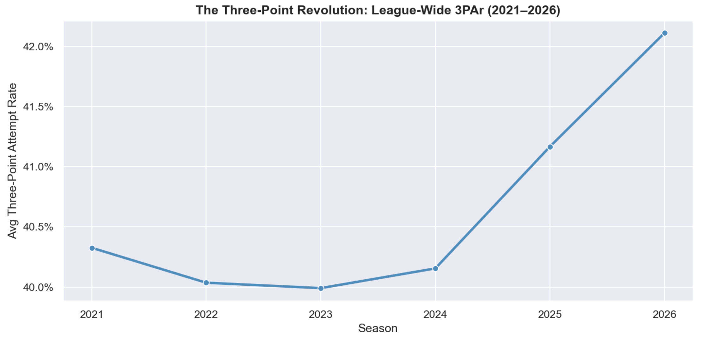
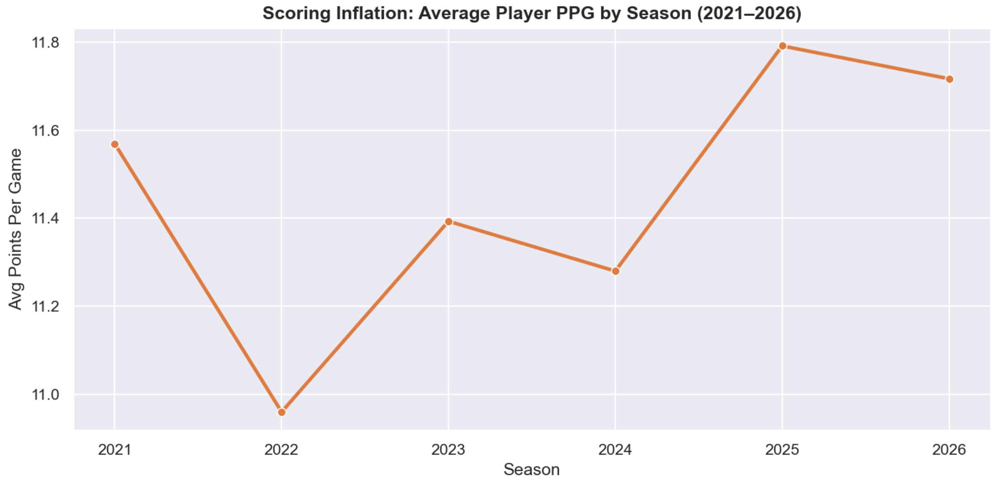
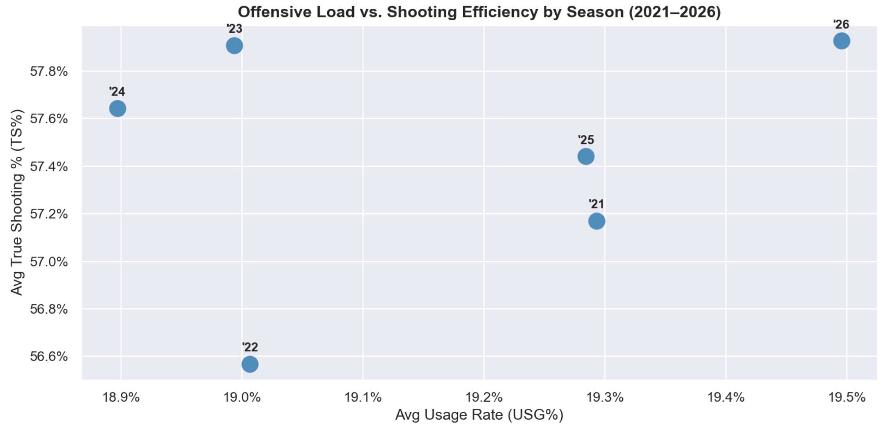
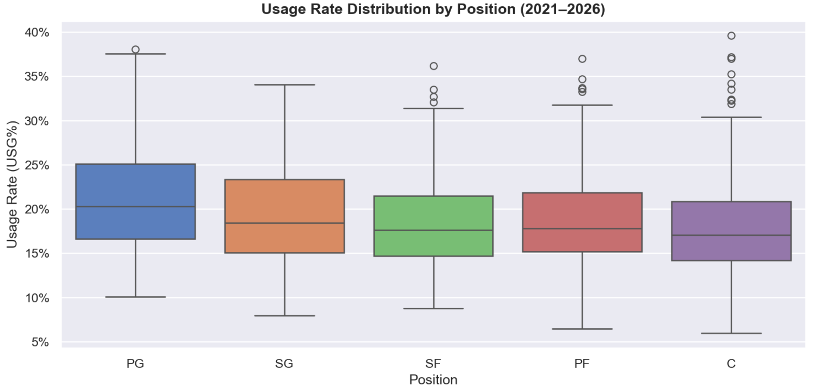
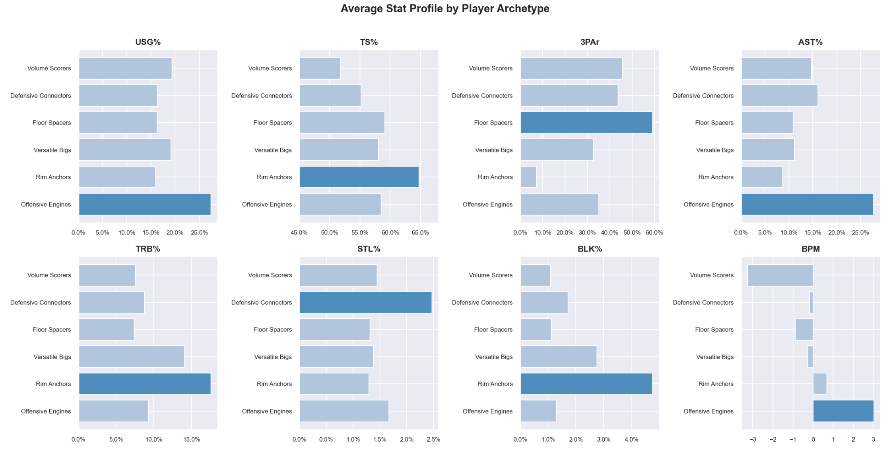
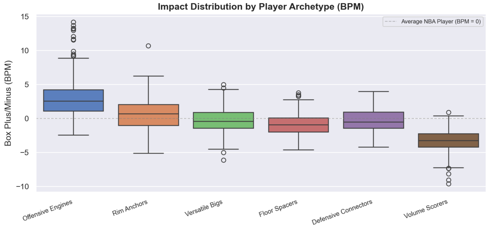
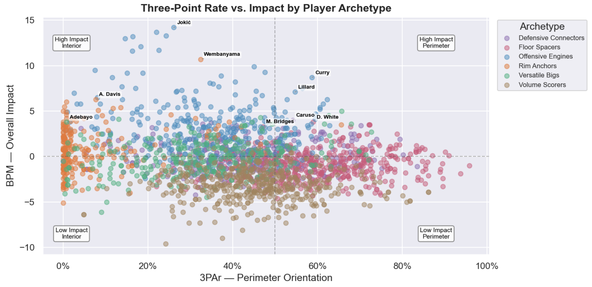

# NBA Player Value Analysis (2021-2026)
## Client Background
A Western Conference franchise's analytics department is preparing for the 2026 offseason and wants to move beyond traditional scouting by leveraging six seasons of performance data to identify undervalued players, understand roster composition, and flag breakout candidates before they price themselves out of the market. This analysis is structured around four questions front offices increasingly need data to answer: how has the league itself changed, what types of players actually exist, who is being paid fairly, and who has the potential to break out.

**The League Landscape:**
An examination of league-wide trends from 2021 to 2026 across scoring, shot selection, and efficiency, establishing the analytical context for evaluating individual players in later sections.

**Defining the Modern NBA Player:**
An unsupervised clustering analysis grouping 2,068 player-seasons into six meaningful archetypes based on efficiency, usage, and skill profiles, moving beyond traditional position labels to capture what players actually do on the floor.

**Contract Value & Market Efficiency:**
A Ridge regression model predicting fair market salary as a percentage of the cap, then comparing predicted versus actual salary to surface undervalued and overvalued players across the league.

**Breakout Candidate Identification:**
A Random Forest classification model identifying players likely to significantly improve their impact from one season to the next, helping the front office target players before their next contract reflects their true ceiling.

The data cleaning notebook can be found here.

The full analysis notebook can be found here.

# Key Insights
## The League Landscape (2021-2026)
The NBA has undergone measurable structural shifts across just six seasons. The league's average three-point attempt rate climbed from **40.3% in 2021** to **42.1% in 2026**, a steady upward trend reflecting an offensive philosophy that has fully committed to the analytics-driven shot hierarchy. The pace of change accelerated noticeably in the final two seasons, suggesting the three-point revolution has not plateaued.

  

This shift in shot selection did not happen in isolation. Average scoring per player rose from **11.6 PPG in 2021** to **11.7 PPG in 2026**, peaking at **11.8 PPG in 2025**, suggesting the move toward higher-value shots has contributed to real scoring inflation rather than simply redistributing the same points differently.

  

League-wide true shooting percentage improved alongside scoring, rising from **57.2% in 2021** to **57.9% in 2026**. The 2022 season stands out as the lone efficiency dip at **56.6% TS%** before the league rebounded. Average usage rate shifted modestly from **19.3% to 19.5%** over the same window, indicating that scoring gains came from better shot quality rather than concentrated offensive responsibility.

  

At the positional level, point guards carry the highest median usage rate and the tightest spread, reflecting their role as primary ball handlers and offensive initiators. The outlier dots above each position's whiskers represent star-level exceptions whose usage rates would be extraordinary at any position.

  

## Defining the Modern NBA Player
Traditional position labels such as point guard, shooting guard, and small forward usually tell you where a player stands and their role on the court. As the league has evolved, players have developed more versatile skill sets that transcend these conventional categories. To better capture these evolving roles, KMeans clustering was applied to **2,068 player-seasons** across 8 advanced metrics covering usage, efficiency, shot selection, playmaking, rebounding, and two-way impact. Six archetypes emerged, each capturing a distinct and recurring player profile across the modern NBA.

**Offensive Engines** (346 player-seasons) are players around whom entire offenses are built, averaging a **27.4% usage rate**, **27.7% assist rate**, and **+3.0 BPM**, the only archetype with a meaningfully positive average impact score. Nikola Jokic, Luka Doncic, Giannis Antetokounmpo, and Shai Gilgeous-Alexander all land here.

**Rim Anchors** (227 player-seasons) post the highest average **TS% at 65%** and the lowest **3PAr at 7%**, anchoring defenses and finishing efficiently near the basket. Victor Wembanyama, Anthony Davis, and Rudy Gobert are the defining names of this group.

**Versatile Bigs** (309 player-seasons) combine rebounding and shot-blocking with enough perimeter shooting and playmaking to function in modern offenses. Bam Adebayo, Lauri Markkanen, and Al Horford represent this archetype.

**Floor Spacers** (482 player-seasons) are the largest archetype by count, high-volume three-point shooters averaging a **59% 3PAr** who create space for others. Some notable names being: Derrick White, Cameron Johnson, and Mikal Bridges.

**Defensive Connectors** (279 player-seasons) are defense-first wings and guards who generate steals, rebound at a high rate for their position, and connect offensive possessions without demanding usage. Alex Caruso, Draymond Green, and Gary Payton II define this group.

**Volume Scorers** (425 player-seasons) carry the lowest average **TS% at 52%** and a **-3.3 BPM**, demonstrating the gap between scoring volume and actual impact.

  

The BPM distribution confirms the hierarchy embedded in these labels. **Offensive Engines** are the only archetype with a median in All-Star caliber territory at **+3.0 BPM,** while **Volume Scorers** sit at **-3.3 BPM,** squarely in replacement-level range and the only group with a median that deep in negative territory. **Rim Anchors** land near the solid starter threshold at **+0.68 BPM,** while **Versatile Bigs, Floor Spacers,** and **Defensive Connectors** cluster in the average to slightly-below-average range, reflecting the reality that most NBA roster spots are filled by players who contribute situationally rather than transformatively.

  

The 3PAr versus BPM scatter places every player on two immediately readable axes, perimeter orientation and overall impact. Within each archetype, the highest-impact seasons rise to the top: **Jokic** anchors the interior elite, **Curry** and **Lillard** lead the perimeter, **Wembanyama** and **Anthony Davis** headline the **Rim Anchors**, **Derrick White** and **Mikal Bridges** represent the Floor Spacers, and **Alex Caruso** sits at the top of the Defensive Connectors. The lower half of the chart reflects the volume-without-value players that populate most rosters regardless of perimeter orientation.

  

## Contract Value & Market Efficiency
A Ridge regression model was trained on eight performance features (PER, TS%, WS/48, BPM, VORP, USG%, minutes played, and age) to predict each player's fair market salary as a percentage of the cap, restricted to players with at least 500 minutes. Across a held-out test set the model achieved an **R² of 0.574** and a **mean absolute error of 4.41% of the cap**, equivalent to roughly **$6.2M** at current cap levels. The **43% of variance** left unexplained reflects legitimate non-statistical salary drivers — injury history, market size, contract timing, and star power that no box score can fully encode.

The feature coefficient chart reveals what the market actually prices. **Age and usage rate** are the two strongest positive predictors of salary, outpacing pure efficiency metrics like BPM and WS/48 by a significant margin. True shooting percentage carries near-zero weight. This is a genuine market inefficiency — teams pay for star power and volume, not value. The negative coefficient on WS/48 is a multicollinearity artifact driven by its overlap with BPM and VORP, not a substantive finding.

In terms of undervalued players, **Luka Doncic** appears in both 2021 and 2022, underpaid by **$19.8M and $22.8M** respectively during his pre-extension seasons when rookie-scale contracts failed to reflect MVP-caliber production. **Trae Young** in 2022 shows a similar **$21.2M discrepancy**, and **Victor Wembanyama** in 2026 represents the same dynamic on his rookie deal.

On the overvalued side, Ben Simmons appears in both 2023 and 2025 as the most consistently overvalued player in the dataset, overpaid by **$29.1M and $31.5M** respectively against a max contract his near-zero offensive output cannot justify. **Jayson Tatum** in 2026 carries the largest single-season overvaluation at **$33.2M** (due to injury), and **Bradley Beal** in 2025 follows at **$29.9M**.

**Model Note:** Russell Westbrook (2026) and Carmelo Anthony (2021, 2022) appear among the most undervalued due to veteran minimum salaries paired with historically high usage rates. The model interprets high usage as a signal of value, inflating their predicted salaries. These cases are flagged and excluded from actionable roster recommendations.

## Breakout Candidate Identification
A Random Forest classifier was trained on **897 eligible player-seasons** to identify players likely to improve their BPM by **+2.0 or more** from one season to the next. The model was restricted to players aged 27 or younger with at least 500 minutes logged and a prior BPM below +4.0, producing a natural **breakout rate of 18.3%** across the eligible sample.

With a **0.3 decision threshold**, the model achieves a **recall of 0.70**, catching **70%** of actual breakout players at the cost of lower precision. For a front office use case this tradeoff is intentional — missing a breakout candidate is more costly than investigating a false positive. The model is a first-pass screening tool designed to narrow a large player pool to a high-priority watchlist, not a replacement for scouting.

**BPM** is the strongest single predictor at **29.5% feature importance**, followed by **TS% at 23.1%**, **minutes at 16.8%**, **USG% at 16.2%**, and **age at 14.5%**. Players who are already producing efficiently but operating in restricted roles have the clearest developmental path.

The probability distribution shows how the model separates actual breakout players from non-breakout players across the predicted probability range. Actual breakout players are more concentrated on the right side of the distribution, confirming the model is directionally correct even where separation is not clean.

### Model Validation
To validate predictive power, the model was applied retroactively to the season preceding each of the last three Most Improved Player finalist classes. Of the nine finalists across 2024, 2025, and 2026, **seven were correctly flagged one season before their breakout year**. The two remaining players were filtered out by eligibility thresholds rather than missed by the model.

The strongest single call was **Cade Cunningham** in 2024, flagged at a **56.2% breakout probability** before his 2025 MIP finalist season. **Tyrese Maxey** (40.1%), **Coby White** (35.5%), **Ivica Zubac** (36.5%), **Dyson Daniels** (36.4%), and **Deni Avdija** (35.1%) were all identified above the decision threshold a full season before the market recognized their improvement.

### 2027 Breakout Watchlist
The watchlist identifies the highest-probability breakout candidates entering 2027 who are also currently undervalued relative to their predicted market salary. This combined signal represents the clearest buy-low opportunity for a front office building toward a championship window. The dollar figure on each bar reflects how much the model believes the player is being underpaid.

The watchlist uses each player's two most recent seasons to surface the best delta rather than anchoring solely to the latest. A single down year driven by injury, a coaching change, or a reduced role can obscure genuine value — and those are precisely the situations worth investigating before a player's next contract corrects the discount.

**Jeremiah Fears** leads the list at a **68% breakout probability**, a 19 year old with over **2,100 minutes** already logged. **Cooper Flagg** is the headline name for roster-building purposes — an Offensive Engine on a rookie deal flagged at **46%** and underpaid by **$5.0M**. **Devin Carter** carries the strongest archetype fit at +**$5.1M**, a Defensive Connector whose connective wing profile every contender is looking for. **Kyshawn George** posts the largest dollar discrepancy on the list at +**$8.9M**.

## Recommendations
### Roster Construction
- **Build around archetypes, not positions.** Pairing Offensive Engines with Defensive Connectors and Floor Spacers at below-market rates is the most repeatable path to a contending roster in the modern NBA.
- **Avoid overpaying for Volume Scorers.** With an average **BPM of -3.3** and **TS% of just 52%**, this archetype consistently underdelivers relative to its salary. High usage does not equal high value.
- **Target Rim Anchors as undervalued assets.** They post the highest average TS% in the dataset at **65%** but remain underpriced relative to perimeter creators in the open market.
- **Treat archetypes as a spectrum, not a fixed label.** Players can sit at the boundary of two archetypes or shift between them across seasons depending on role, usage, and system fit. A **Versatile Big** asked to shoot more threes may migrate toward **Floor Spacer** territory; a **Defensive Connector** given more offensive responsibility may trend toward **Volume Scorer**. Tracking archetype movement year over year can surface players whose roles are expanding before their contracts reflect it.

### Contract Strategy
- **Act on the buy-low watchlist before free agency.** Players flagged by both the regression and breakout models represent a shrinking window — their next contracts will reflect their rising value. **Cooper Flagg**, **Devin Carter**, and **Jaylen Wells** are some of the top priority targets.
- **Use predicted salary as a negotiation anchor.** The model's fair market estimates provide a data-backed baseline for contract offers, particularly for players on rookie deals whose actual salaries lag significantly behind their production.

### Model Usage
- **Use the breakout watchlist as a scouting filter, not a final answer.** The classifier achieves **70%** recall on statistical features alone. Role changes, injury recoveries, and system fit drive the remaining **30%**. Pair model output with film and context to create more informed decisions.
- **Filter by archetype to target specific roster needs.** The contract value model can be applied within any single archetype to surface the most underpaid players at a given position profile. You're able to group candidates such as Floor Spacers or Defensive Connectors by predicted salary delta within that group, narrowing the market to players who both fit the roster and represent value and upside.
